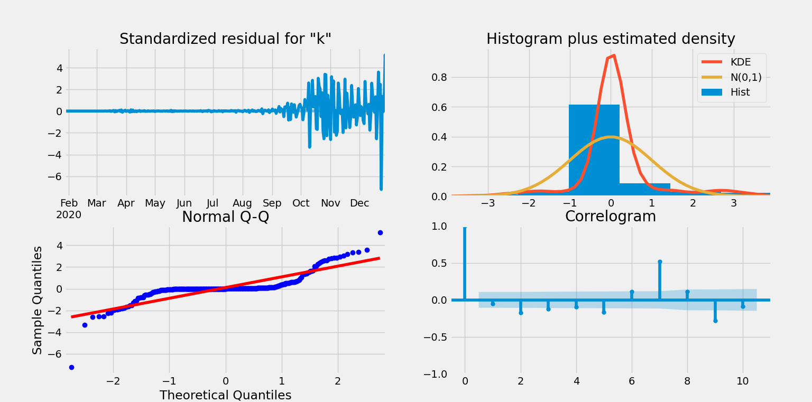
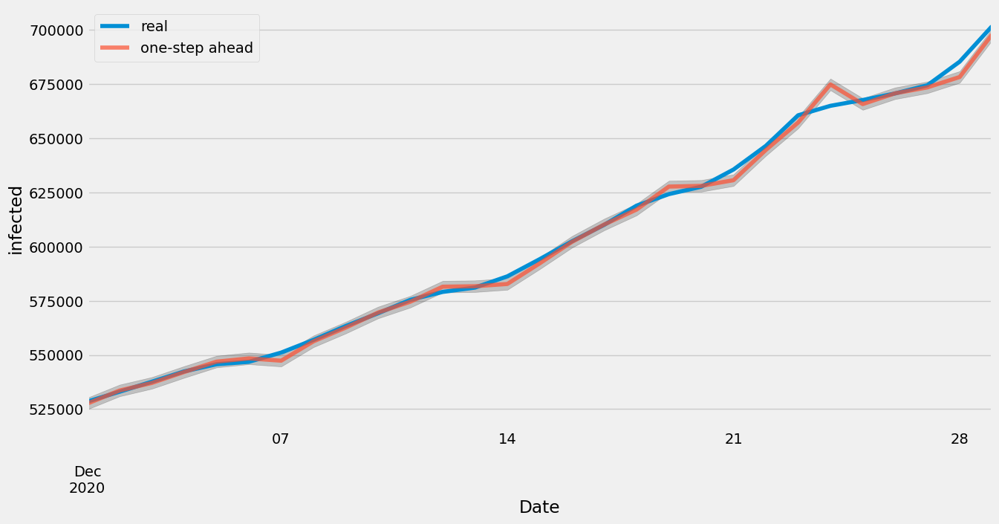
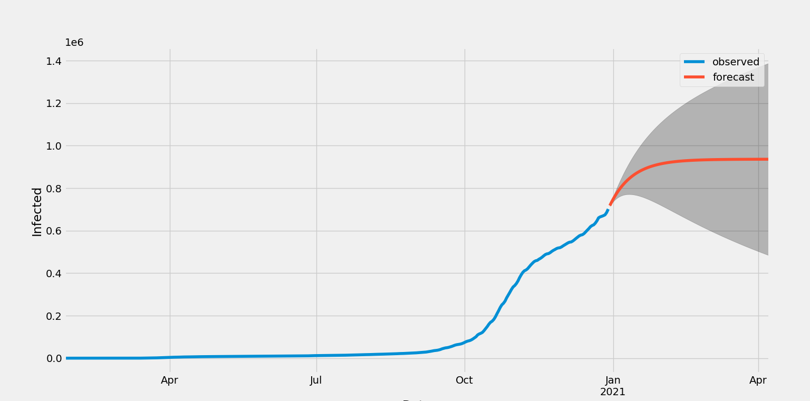

# Task: Prediction of COVID-19 development
1. obtain data for number of infected people in Czech Republic
2. create model
3. create prediction
4. compare with models for other countries
Requirements: Python

## Data
I used the dataset available at https://onemocneni-aktualne.mzcr.cz/api/v2/covid-19/nakazeni-vyleceni-umrti-testy.csv

##Model
- I decide to use the statistical model ARIMA
- I choose optimal parameters by grid search
- Model makes the biggest mistakes predicting covid "second wave" from September up  to present
- Model results:
     * Results from September  up to December
        * MSE = 8 7468 923 572.4
        * RSE = 295 751.46
     * Results from March to September
        * MSE = 4 420 543 768.92
        * RSE = 66 487.17
        

- December prediction

- Future Prediction

##Limitation
- Covid is in the Czech republic one year, not long enough to determine seasonal trend (something like "flu season")
- In my opinion, predicting anything only based on time is nearly impossible, it would mean that only time has an impact on a number of infected people and other influences don't change.
 It would be interesting to take into account other factors such as state restriction, number of vaccinated people, number of immune people (cured people with a significant level of antibodies), and so on.
